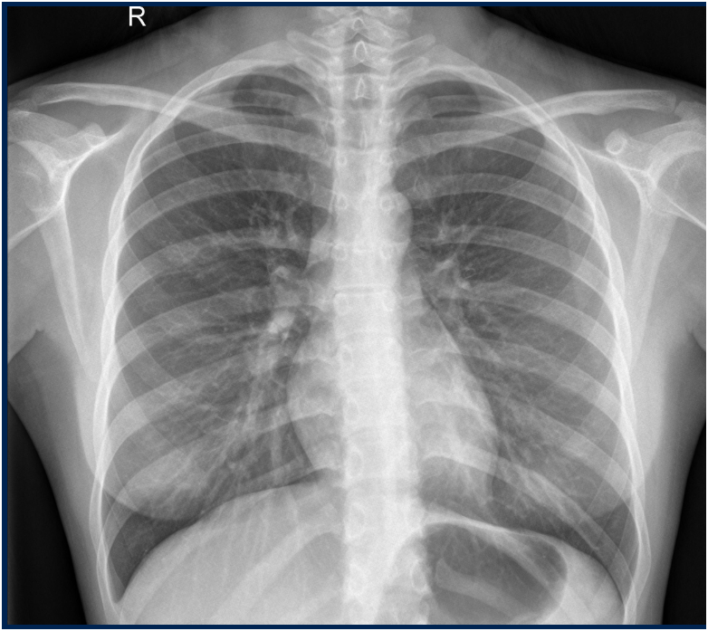
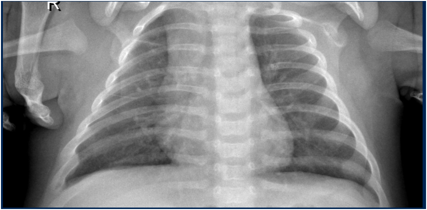
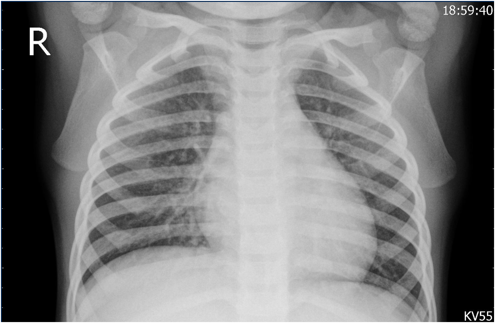

## 🎯 Problématique

La détection précoce de la pneumonie est cruciale pour le traitement, mais l'analyse manuelle de radiographies thoraciques est chronophage et sujette à l'erreur humaine.

## 💡 Solution

Développement d'un modèle de deep learning basé sur **ResNet50** pour automatiser la détection de pneumonie sur des radiographies thoraciques avec une précision cliniquement pertinente.
## 📸 Exemples de Détection

*Détection de pneumonie sur radiographie thoracique*

*Analyse automatique avec score de confiance*

*Cas normal - Poumons sains*

*Visualisation des prédictions du modèle ResNet50*
## 🔧 Architecture Technique

- **Modèle :** ResNet50 pré-entraîné + fine-tuning
- **Dataset :** Chest X-Ray Images (Pneumonia) - Kaggle
- **Prétraitement avancé :**
  - Normalisation des images
  - Augmentation de données (rotation, zoom, flip)
  - Redimensionnement et preprocessing spécifique
- **Pipeline ML complet :** entraînement, validation, évaluation

## 📊 Performances

- **Précision globale : 88,62%**
- **Recall (sensibilité) : 92%** (faible taux de faux négatifs)
- **Temps d'inférence : <1 seconde**
- **Dataset : 5,863 images** (train/validation/test)

## 🛠️ Stack Technique

- **Framework :** TensorFlow / Keras
- **Modèle :** ResNet50 (Transfer Learning)
- **Traitement d'images :** OpenCV, PIL
- **Visualisation :** Matplotlib, Seaborn
- **Environnement :** Jupyter Notebook, Python

## 🎯 Impact

Ce projet démontre l'application concrète du deep learning dans le domaine médical, avec un modèle capable d'assister les radiologues dans le diagnostic précoce de la pneumonie, potentiellement sauvant des vies.

## 🎓 Apprentissages

Maîtrise du transfer learning, gestion de datasets médicaux déséquilibrés, techniques d'augmentation de données avancées, et importance des métriques adaptées au contexte médical (privilégier le recall pour éviter les faux négatifs).
